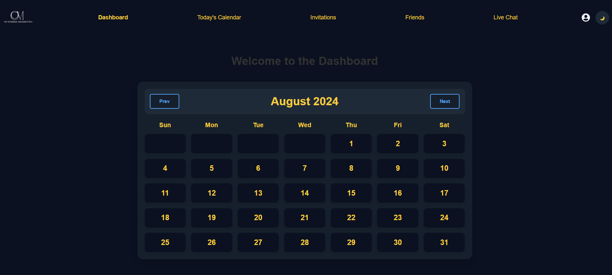

# CalendaMe

**CalendaMe** is a full-featured calendar scheduling application designed to help users manage their schedules, connect with friends, and communicate in real-time during events. The inspiration for this project comes from the need for a seamless and intuitive scheduling tool that combines social connectivity with robust event management. The application provides a user-friendly interface with features like friend management, event invitations, and live chat. My goal is to continuously improve this project, making it a central piece of my software engineering portfolio.

## Live Link

[Visit CalendaMe](https://calendame.onrender.com)

### GitHub Repository

[Link to Repository](https://github.com/shandawang1005/CalendaMe_project)

## Summary

CalendaMe is built using Flask for the backend and React for the frontend, offering a comprehensive set of tools for scheduling and event management. The application is designed to be easy to use, enabling users to create events, manage their schedules, and communicate with friends, all in one place.

## Screenshots

- **Home Page**
  
- **Calendar View**
  
- **Chatting System**
  

## Technologies Used

### Frontend:

- 
- 
- 
- 
- 

### Backend:

- 
- 
- 
- 

### Hosting:

- 

## Index

- [Feature List](https://github.com/shandawang1005/CalendaMe_project/wiki/MVP's-Feature-List)
- [Database Schema](https://github.com/shandawang1005/CalendaMe_project/wiki/DB-Schema)
- [User Stories](https://github.com/shandawang1005/CalendaMe_project/wiki/User-Stories)
- [Wireframes](https://github.com/shandawang1005/CalendaMe_project/wiki/Example-WireFrames)

## Features

### User Authentication System

- Users can sign up, log in, log out, and access protected content.

### Friend System

- Users can search for friends, send friend requests, accept/decline friend requests, view friends, and remove friends.

### Event Management

- Users can create, edit, and delete events.
- Users can invite friends to events via invitations.

### Live Chat

- Real-time chat functionality for users to communicate during events.

### Invitation System

- Users can send and manage event invitations, allowing friends to join events.

## Endpoints

### Auth Routes

#### Current User

- **Purpose:** Fetches the current user's information upon initial app load and subsequent navigations.
- **Method:** `POST`
- **URL:** `/api/auth/`
- **Successful Response:** `HTTP Status Code 200`
  ```json
  {
    "email": "string",
    "id": "integer",
    "username": "string"
  }
  ```
- **Error Response:** `HTTP Status Code 401`
  ```json
  {
    "errors": "Unauthorized"
  }
  ```

#### Sign Up

- **Purpose:** Sends signup form data to the backend to create a new user.
- **Method:** `POST`
- **URL:** `/api/auth/signup`
- **Successful Response:** `HTTP Status 201`
  ```json
  {
    "id": "integer",
    "username": "string",
    "email": "string"
  }
  ```
- **Error Response:** `HTTP Status 400`
  ```json
  {
    "errors": ["string"]
  }
  ```

#### Login

- **Purpose:** Attempts to log in a user with the provided credentials.
- **Method:** `POST`
- **URL:** `/api/auth/login`
- **Successful Response:** `HTTP Status 200`
  ```json
  {
    "id": "integer",
    "username": "string",
    "email": "string"
  }
  ```
- **Error Response:** `HTTP Status 400`
  ```json
  {
    "errors": ["string"]
  }
  ```

#### Logout

- **Purpose:** Logs out the current user.
- **Method:** `POST`
- **URL:** `/api/auth/logout`
- **Successful Response:** `HTTP Status 200`
  ```json
  { "id": "id", "username": "username", "email": "email" }
  ```
- **Error Response:** `HTTP Status 404`
  ```json
  {
    "errors": "No session"
  }
  ```

#### Change Profile

- **Purpose:** Change user's username/email
- **Method:** `PUT`
- **URL:** `/api/auth/profile`
- **Successful Response:** `HTTP Status 200`
  ```json
  {
    "message": "User logged out"
  }
  ```
- **Error Response:** `HTTP Status 400`

  ```json
  {
    "errors": "No session"
  }
  ```

  #### Change Password

- **Purpose:** Change user's password
- **Method:** `POST`
- **URL:** `/api/auth/change-password`
- **Successful Response:** `HTTP Status 200`
  ```json
  { "message": "Password changed successfully." }
  ```
- **Error Response:** `HTTP Status 400`
  ```json
  { "error": "Current password is incorrect." }
  ```

### Friend Routes

#### Get Friends

- **Purpose:** Fetches the list of friends for the current user.
- **Method:** `GET`
- **URL:** `/api/friends/`
- **Successful Response:** `HTTP Status 200`
  ```json
  {
    "friends": { "accepted": "accepted_friends", "pending": "pending_requests" }
  }
  ```
- **Error Response:** `HTTP Status 400`
  ```json
  {
    "errors": "User not found"
  }
  ```

#### Add Friend

- **Purpose:** Sends a friend request to another user.
- **Method:** `POST`
- **URL:** `/api/friends/request`
- **Body:**
  ```json
  {
    "friend_id": "integer"
  }
  ```
- **Successful Response:** `HTTP Status 201`
  ```json
  {"message": "Friend request sent", "friend": serialize_friend(friend_user)}
  ```
- **Error Response:** `HTTP Status 400`
  ```json
  { "error": "Friend ID is required" }
  ```

#### Accept Friend Request

- **Purpose:** Accepts a friend request from another user.
- **Method:** `POST`
- **URL:** `/api/friends/<int:friendship_id>/respond`
- **Body:**
  ```json
  {
    "friend_id": "integer"
  }
  ```
- **Successful Response:** `HTTP Status 200`
  ```json
  {"message": f"Friend request {response}ed"}
  ```
- **Error Response:** `HTTP Status 400`
  ```json
  { "error": "Invalid response" }
  ```

#### Decline Friend Request

- **Purpose:** Accepts a friend request from another user.
- **Method:** `DELETE`
- **URL:** `/api/friends/cancel/<int:friend_id>`
- **Body:**
  ```json
  {
    "friend_id": "integer"
  }
  ```
- **Successful Response:** `HTTP Status 200`
  ```json
  { "message": "Friend request canceled" }
  ```
- **Error Response:** `HTTP Status 400`
  ```json
  { "error": "Pending friend request not found" }
  ```

#### Remove Friend

- **Purpose:** Removes a friend from the current user's friend list.
- **Method:** `DELETE`
- **URL:** `/api/friends//<int:friend_id>/remove`
- **Body:**
  ```json
  {
    "friend_id": "integer"
  }
  ```
- **Successful Response:** `HTTP Status 200`
  ```json
  {
    "message": "Friend removed","friend": serialize_friend(friend_user)
  }
  ```
- **Error Response:** `HTTP Status 404`
  ```json
  { "error": "Friendship not found" }
  ```

### Event Routes

#### Get Events

- **Purpose:** Fetches all events for the current user.
- **Method:** `GET`
- **URL:** `/api/calendar/`
- **Successful Response:** `HTTP Status 200`
  ```json
  {
    "id": "id",
    "title": "title",
    "start_time": "start_time.strftime"("%Y-%m-%d %H:%M:%S"),
    "end_time": "end_time.strftime"("%Y-%m-%d %H:%M:%S"),
    "location": "location",
    "visibility": "visibility",
    "recurring": "recurring",
    "creator_id": "creator_id",
    "participants": [
      {
      "id": "id",
      "user_id": "user_id",
      "username": "user.username"
      if "user"
      else "None",  # Add null check for user relationship
      "event_id": "event_id",
      "status": "status",
      }
    ],
  }
  ```
- **Error Response:** `HTTP Status 404`
  ```json
  {
    "errors": "No events found"
  }
  ```

#### Create Event

- **Purpose:** Creates a new event.
- **Method:** `POST`
- **URL:** `/api/calendar/add`
- **Body:**
  ```json
  {
    "title" = "title"
    "start_time" = "start_time"
    "end_time" = "end_time"
    "location" ="location"
    "visibility" ="visibility"
  }
  ```
- **Successful Response:** `HTTP Status 201`
  ```json
  {"message": "Event added successfully!", "event": new_event.to_dict()}
  ```
- **Error Response:** `HTTP Status 400`
  ```json
  {
    "errors": ["string"]
  }
  ```

#### Edit Event

- **Purpose:** Edits an existing event.
- **Method:** `PUT`
- **URL:** `/api/events/edit/:id`
- **Body:**
  ```json
  {
    "title" = "title"
    "start_time" = "start_time"
    "end_time" = "end_time"
    "location" ="location"
    "visibility" ="visibility"
  }
  ```
- **Successful Response:** `HTTP Status 200`
  ```json
  {"message": "Event updated successfully!", "event": event.to_dict()}
  ```
- **Error Response:** `HTTP Status 400`
  ```json
  {
    "errors": ["string"]
  }
  ```

#### Delete Event

- **Purpose:** Deletes an event.
- **Method:** `DELETE`
- **URL:** `/api/calendar/delete/<int:event_id>`
- **Successful Response:** `HTTP Status 200`
  ```json
  { "message": "Event deleted successfully!" }
  ```
- **Error Response:** `HTTP Status 404`
  ```json
  { "error": "Event not found" }
  ```

## Future Implementation Goals

- Enhanced event filters and search functionality.
- Integration with additional third-party services.
- Notifications for important events.
- Advanced recurring event options.

## Connect

- [LinkedIn](https://www.linkedin.com/in/shanda-wang)
